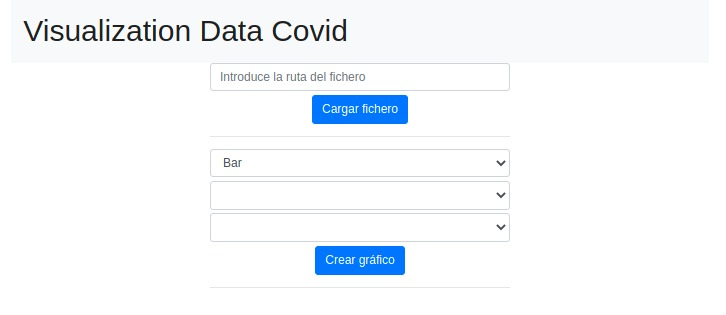
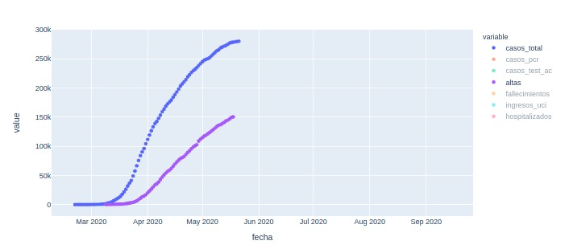
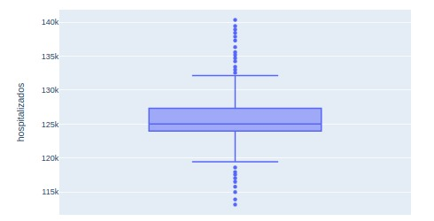

# visualization_data_covid

#### Alberto Martín Núñez

## Indice de contenidos

1. [Objetivo de la práctica](#id1)
2. [Herramientas utilizadas](#id2)
3. [Visualización de gráficos](#id3)
4. [Distribuciones](#id4)
5. [Creacion de un mapa](#id5)

### Objetivo de la práctica 

El objetivo de esta práctica es realizar un pequeño entorno de visualización. En primera instancia el framework debería usar al menos dos tipos de gráficos(**lineas y barras**). Posteriormente se ha añadido la posibilidad de crear un gráfico disperso y seleccionar varios grupos. 

Se ha añadido la opción de crear distribuciones de los datos y la extracción de información de los mismos, como **histogramas**, **curvas de densidad**, **boxplots**, etc.

Por último, podremos utilizar un **mapa** para mostrar algunos datos específicos.

### Herramientas utilizadas 

Para realizar esta práctica se ha hecho uso de **Flask** un micropframework de Python que nos permite crear aplicaciones web sencillas y de fomar bastante ligera bajo el patron MVC, el cual nos permite trabajar de forma que podemos diferenciar y separar el modelo de datos(BD), la vista(HTML) y el controlador(peticiones web).

### Visualización de gráficos 

Para la recoger de datos se ha utilizado un repositorio que he encontrado en **github** con bastante información:

*https://github.com/datadista/datasets/tree/master/COVID%2019*

Para acceder a la visualización tenemos que ejecutar nuestro *app.py* usando `python3 app.py` y accediendo a *localhost:4000* se nos abrirá una web como está:

*Los ficheros que podemos utilizar son de extension .csv*

Insertamos la ruta del fichero y pulsamos "Cargar fichero". Si el fichero no tiene un campo 'fecha' podremos seleccionar el tipo de gráfico, la x y la y. Sin embargo, si el fichero tiene algún campo 'fecha' solo podremo seleccionar el tipo de gráfico, ya que cuando creemos el gráfico podrmeo seleccionar las diferentes opciones de una forma interactiva y visual.

Aqui tenemos un ejemplo usando un gráfico de tipo *scatter*:

### Distribuciones 

Para mostrar las distribuciones que he creado(**boxplot y histogramas**) tenemos que ir a la ruta *http://localhost:4000/diagramas* en donde tendremos un formulairo muy parecido al anterior. En él podremos elegir el tipo de distribución queremos representar y los parámetros.

Aqui podemos comprobar como la mayoria de los datos de entrada de personas hospitalizadas estan por encima de 120.000 cada día.

### Creacion de un mapa 